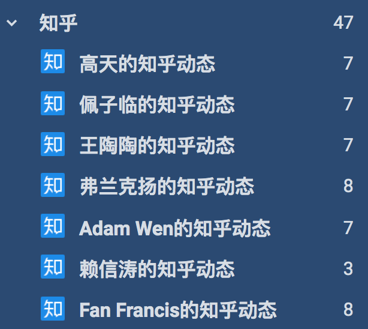

# RSSHub 知乎小助手


如果你希望通过 [RSSHub](https://docs.rsshub.app/) 浏览知乎，那么这个项目或许可以帮到你。本项目假定读者有一定的编程基础，并且电脑上安装有 Python 3.6+ 的环境。

想象这样一个场景。你想通过 RSSHub 订阅**很多**知乎用户的动态，但是又不想一个个地复制用户的 url_token（比如 `https://www.zhihu.com/people/diygod` 中的 `diygod`）来生成 feed 并加入 RSS 阅读器。如何更方便地完成这一系列操作呢？

首先，你需要知道有一种文件格式叫做 [`OPML`](https://blog.walterlv.com/post/using-opml-for-rss-migrating.html)，说白了就是一堆 RSS feed 的集合。大部分 RSS 阅读器都支持通过 OPML 批量导入 feed。比如我现在使用的 [Inoreader](https://blog.inoreader.com/2014/05/opml-subscriptions.html)。

我们的思路就是先生成包含所需知乎用户 feed 的 OPML，然后用 RSS 阅读器导入。

## 1. 安装依赖

```bash
git clone https://github.com/laike9m/rsshub-zhihu-helper.git
cd rsshub-zhihu-helper

# If you use Poetry
poetry install

# Otherwise
pip install -r requirements.txt

# Downloads a recent version of Chromium (~100MB)
pyppeteer-install
```

## 2. 部署 RSSHub

[步骤](https://docs.rsshub.app/install/#bu-shu)

部署私有 RSSHub 实例，才能保证 RSS 阅读器之后能顺利抓取。参见 [RSSHub 文档](https://docs.rsshub.app/faq.html#chang-jian-wen-ti)：

> **Q: 演示地址可以用么？**
>
> **A:** 演示地址为 [rsshub.app](https://rsshub.app/), 缓存时间 20 分钟, 可以随意使用。但如果你看到路由有 反爬严格 标记，如微博、知乎等，意味着目标网站有严重的反爬策略，demo 无法确保可用性，建议自建来提高稳定性。

这里假定你已经自行部署，且 RSSHub 服务器地址位于 `my.rsshub.com`。

## 3. 使用

设置环境变量 `export my_rsshub_addr="my.rsshub.com"`。如果不设置，会使用演示地址 `rsshub.app`（不建议这么做）。

首先确保你位于 `rsshub-zhihu-helper` 这个目录中

```bash
# 在本地启动服务器
uvicorn main:app --reload
```

访问 [http://127.0.0.1:8000/](http://127.0.0.1:8000/)，看完这个 gif 你就知道怎么用了：


最后在桌面上会生成一个 `zhihu_feeds.xml` 文件，内容如下：

```xml
<opml version="2.0">
    <body>
        <outline text="Subscriptions" title="Subscriptions">
            <outline xmlUrl='http://my.rsshub.com/zhihu/people/activities/wang-tao-tao-91-97' />
            <outline xmlUrl='http://my.rsshub.com/zhihu/people/activities/ffancage' />
        </outline>
    </body>
</opml>
```

之前不是选了两个用户吗？这就是包含了两个用户动态 feed 的 OPML 文件。

## 4. 导入 RSS 阅读器

这步取决于你用的哪个阅读器。[Inoreader](https://blog.inoreader.com/2014/05/opml-subscriptions.html) 是已知对 OPML 及 RSSHub feed 支持较好的阅读器。导入完成之后是这个样子。



你再也不需要依赖知乎网站或是 App 了，hoooray🎉🎉
